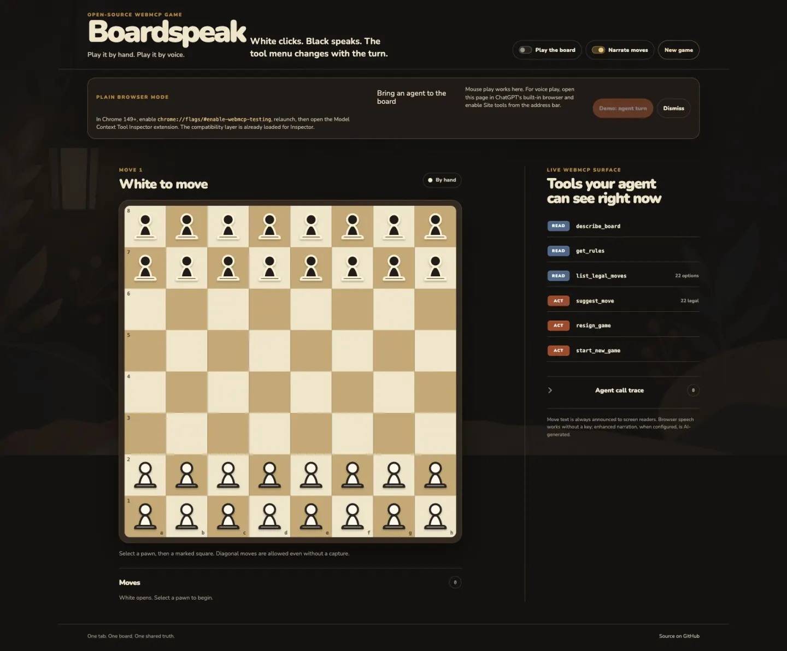
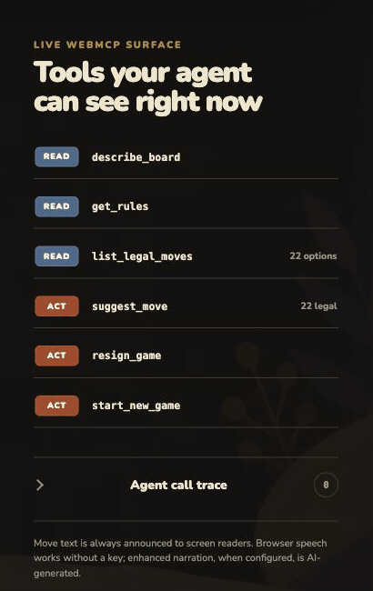

# Boardspeak

**Play it by hand. Play it by voice.**

[Play Boardspeak](https://boardspeak.vercel.app)

**[Watch the final demo](https://youtu.be/xrl2Woj9iRc)** · [Read the Devpost submission](https://devpost.com/software/boardspeak-see-the-tools-your-agent-can-use-in-a-game)

**[Try Demo: agent turn on the live site](https://boardspeak.vercel.app/?demo=1).** It works in a plain browser: move White once, then use the demo control to send one legal Black move through the same traced executor an agent uses.

## What it is

Boardspeak is an open-source web implementation of Breakthrough (Dan Troyka, 2000): White plays with a mouse or built-in bot, while Black plays by talking or typing to an agent, using the on-page Chrome microphone, or clicking. An AI agent normally has two bad options for using a website, screenshot-and-guess or a separate MCP server; WebMCP is the third way, letting the page itself publish what the agent can do from the same live board state, with legal tools changing every turn.

> Demo video: [watch the final three-minute walkthrough on YouTube](https://youtu.be/xrl2Woj9iRc).



[View the complete 360px layout capture](./public/readme/boardspeak-mobile.webp).

## Status

Boardspeak is live at [boardspeak.vercel.app](https://boardspeak.vercel.app). The production release includes the complete Breakthrough engine, mouse game, nine-tool WebMCP surface, a legal-move microphone for Black, solo practice mode, layered narration, and an inspectable call trace for [The WebMCP Challenge](https://openai.com/webmcp-challenge/).

## Quick start

```bash
pnpm install
pnpm dev
```

Open [http://localhost:3000](http://localhost:3000).

Add `?demo=1` in a plain browser. After White moves, **Demo: agent turn** invokes one legal Black move through the same traced execution path an agent uses.

Turn on **Bot plays White** to let the built-in White bot answer after 300ms. Black remains controlled by the agent, the on-page microphone, or the mouse, so one person can demonstrate the complete game loop.

On Black's turn in Chrome, choose **Speak Black move** and say both squares, such as “e7 to e6” or “e7 takes d6.” Speech is matched only against the legal move enum for that turn, then runs through the same validated and traced `play_move` path as an agent call. Say the single keyword **“options”** to hear every current legal move grouped as advances, captures, and winning moves. The keyword is matched exactly and locally, with no LLM interpretation.

Narration is on by default and needs no configuration. Without `OPENAI_API_KEY`, moves use the browser Web Speech API; with the key set only on the server, `/api/narrate` returns short AI-generated speech and silently falls back to Web Speech on any error.

## Play it with your agent

### ChatGPT desktop browser

1. Open [boardspeak.vercel.app](https://boardspeak.vercel.app) inside ChatGPT's built-in browser.
2. Use the latest ChatGPT desktop app with GPT-5.6 Sol or Terra.
3. Enable **Site tools** from the browser address bar if prompted, then ask, “What’s on the board?”

### Chrome 149+

1. Open `chrome://flags/#enable-webmcp-testing`, enable WebMCP testing, and relaunch Chrome.
2. Install the Model Context Tool Inspector extension.
3. Open Boardspeak and inspect the tools registered by the page.

Without native WebMCP, Boardspeak shows a collapsible setup banner and loads the GoogleChromeLabs compatibility layer so the Inspector can still discover the page tools.

## How it works

An agent could play this game three ways. A remote MCP server gives the agent its own copy of the game and cuts the page out of the loop, so the two players stop looking at the same truth. A browser agent guesses legality from pixels. WebMCP puts the tools in the page itself: same tab, same session, same state the human is watching, and legality is not merely a check inside the tool. It is the shape of the tool, an enum regenerated every turn, so an illegal move is not a value the agent can send. Tools that do not apply do not exist. The specification lists improving accessibility through agents as intermediaries as an explicit goal; Boardspeak demonstrates that goal directly.

Each tool uses the imperative `document.modelContext.registerTool` path through `use-webmcp-tool`. When a turn changes the move enum, the previous registration is aborted and the same tool name is registered with the new schema. Every mutation resolves only after React has committed the matching board and rail state, and every call is visible in the on-page trace.

### Where registration happens

[`WebMCPBridge`](components/WebMCPBridge.tsx) supplies each live schema and traced executor to [`use-webmcp-tool`](https://github.com/GoogleChromeLabs/use-webmcp-tool). The hook makes the imperative call below. When an enabled state or move enum changes, React runs the previous effect cleanup, aborting that registration before the hook registers the current schema.

The hook's core registration path, with output formatting and error normalization shortened here, is:

```ts
const controller = new AbortController();

document.modelContext.registerTool(
  {
    name,
    description,
    inputSchema,
    annotations,
    async execute(args) {
      const result = await executeRef.current(args);
      return toToolResponse(result);
    },
  },
  { signal: controller.signal },
);

// React effect cleanup unregisters the old schema before the next registration.
return () => {
  controller.abort();
};
```



## Tool surface

| Tool | When it exists | Mode | Returns |
|---|---|---:|---|
| `describe_board` | Always | READ | Session-aware text, JSON snapshot, outcome, and White-turn next action |
| `get_rules` | Always | READ | Rules, notation, and White-turn next action |
| `list_legal_moves` | Always | READ | Black notations grouped by intent, with totals, truncation status, game-over state, winner, and White-turn next action |
| `play_move` | Black to move | ACT | Move result, updated board, and White-turn next action |
| `play_capture` | Black can capture | ACT | Capture result, updated board, and White-turn next action |
| `list_threats` | A live game has a pawn one step from winning | READ | Threatening pieces by side |
| `suggest_move` | White to move | ACT | A visible, non-binding move suggestion |
| `resign_game` | A game is live | ACT | Confirmed resignation or cancellation |
| `start_new_game` | Always | ACT | Reset result or cancellation |

## Evaluation

Start the deterministic fixture with `pnpm dev:eval`, then run:

```bash
npx webmcp-evals --chrome-channel chrome smoke -u http://localhost:3000 -e evals/cases.json
```

| Case | Expected tool | Smoke result |
|---|---|---|
| Describe the board | `describe_board` | PASS |
| List options | `list_legal_moves` | PASS |
| Advance e7 | `play_move` with `e7-e6` | PASS |
| Take a piece | `play_capture` with `e7xd6` | PASS |
| Resign | `resign_game` | PASS |

**Result: 5/5 steps passed across 5 cases.** Each case opens a fresh page. The eval-only fixture starts on Black's turn with both the required advance and capture legal, and auto-accepts both the resignation confirmation and the tool-driven New Game confirmation.

The final summary should report `5/5 steps passed across 5 cases`.

### Product verification

Run the full local gate:

```bash
pnpm typecheck
pnpm lint
pnpm test
pnpm test:e2e
pnpm build
```

| Check | Result |
|---|---:|
| Unit, reducer, component, narration, voice-input, and WebMCP contract tests | 82/82 PASS |
| Chromium Playwright flows at desktop and 360px | 9/9 PASS |
| Twenty plies plus tool-driven New Game against a duplicate-name-throwing registry | 0 `InvalidStateError` |
| Browser console and uncaught page errors across the nine end-to-end flows | 0 |
| Lighthouse accessibility, mobile production URL | [100](https://boardspeak.vercel.app/readme/lighthouse-accessibility.html) |
| Lighthouse accessibility, desktop production URL | [100](https://boardspeak.vercel.app/readme/lighthouse-accessibility-desktop.html) |
| Next.js production build | PASS |

## Accessibility

The board is a semantic grid of 64 native buttons with exact square and occupancy labels, including “legal destination” and “legal capture” on playable targets, visible keyboard focus, and a polite live move/win log. Three audio layers work in order: that always-available live region, the browser Web Speech API with no configuration, and optional OpenAI text-to-speech when a server-side key is present. Chrome Speech Recognition also provides an on-page Black microphone that accepts only a currently legal source-and-destination pair or the exact local keyword **“options.”** That keyword reads every current legal move aloud in advance, capture, and winning groups without LLM interpretation, so a blind player can independently discover the available moves in plain Chrome. Enhanced narration is disclosed in the interface as AI-generated. The agent-facing description and legal-move tools let a blind player understand and play the same visual position by conversation.

## License

[MIT](LICENSE) © 2026 Robert Huynh. Third-party components and complete notices are listed in [THIRD_PARTY_LICENSES.md](THIRD_PARTY_LICENSES.md).
